# Analisis computacional-cognitivo-conductual del juego de cartas Truco Argentino.

 

¿Podemos crear una IA para el truco?

**Resumen:** El Truco es un juego de cartas Argentino popularmente jugado en el todo el país y el cono sur. 
Es un juego de estrategia competitivo basado en turnos, de estados finitos e información incompleta, lo cúal quiere decir que los jugadores basaran sus estrategias en base a especulaciones en cuanto a las cartas de los demas.
En los últimos tiempos, han existido numerosos articulos cientificos implementando modelos de aprendizaje reforzado en juegos de dichas caracteristicas. No obstante, aun no hay ningun trabajo que haya analizado este particular juego Argentino.
El próposito de este proyecto es analizar este juego desde un aspecto computacional para poder, luego, modelar un agente de aprendizaje reforzado.
Para dicho fin, primero vamos a hacer una revisión de los trabajos cientificos en juegos similares (como el poker), luego conceptualizar algunos terminos clave para abordar dicho problema, proponemos en este trabajo un modelado del oponente en función del comportamiento y estilo cognitivo de jugadores de truco y finalmente, invitamos a la comunidad al involucramiento en el desarrollo de un agente de aprendizaje reforzado para resolver este problema.

## Facilitador

Patricio J. Gerpe

## Preliminares
### Revisión de literatura

En tanto no se han encontrado artículos cientificos en respecto al juego de cartas 'Truco' si existe artículos cientificos que abordan juegos de cartas de información imperfecta tal como el Poker.
Ejemplos incluyen:

* Heinrich, J., & Silver, D. (2016). Deep reinforcement learning from self-play in imperfect-information games. arXiv preprint arXiv:1603.01121. https://arxiv.org/pdf/1603.01121.pdf
* Mealing, R., & Shapiro, J. L. (2017). Opponent Modeling by Expectation-Maximization and Sequence Prediction in Simplified Poker. IEEE Trans. Comput. Intellig. and AI in Games, 9(1), 11-24.
* Kitchen, A., & Benedetti, M. (2018). ExpIt-OOS: Towards Learning from Planning in Imperfect Information Games. arXiv preprint arXiv:1808.10120. https://arxiv.org/pdf/1808.10120.pdf
* Yakovenko, N., Cao, L., Raffel, C., & Fan, J. (2016, February). Poker-CNN: A Pattern Learning Strategy for Making Draws and Bets in Poker Games Using Convolutional Networks. In AAAI (pp. 360-368).
* Ganzfried, S., & Yusuf, F. (2017). Computing human-understandable strategies: Deducing fundamental rules of poker strategy. Games, 8(4), 49.
* Bowling, M., Burch, N., Johanson, M., & Tammelin, O. (2017). Heads-up limit hold'em poker is solved. Communications of the ACM, 60(11), 81-88.
* Li, X., & Miikkulainen, R. (2018, July). Opponent modeling and exploitation in poker using evolved recurrent neural networks. In Proceedings of the Genetic and Evolutionary Computation Conference (pp. 189-196). ACM.
* Dahl, F. A. (2001, September). A reinforcement learning algorithm applied to simplified two-player Texas Hold’em poker. In European Conference on Machine Learning (pp. 85-96). Springer, Berlin, Heidelberg.
* Teófilo, L. F., Passos, N., Reis, L. P., & Cardoso, H. L. (2012). Adapting strategies to opponent models in incomplete information games: a reinforcement learning approach for poker. In Autonomous and Intelligent Systems (pp. 220-227). Springer, Berlin, Heidelberg.
* Erev, I., & Barron, G. (2005). On adaptation, maximization, and reinforcement learning among cognitive strategies. Psychological review, 112(4), 912. https://www.researchgate.net/profile/Ido_Erev/publication/7505648_On_Adaptation_Maximization_and_Reinforcement_Learning_Among_Cognitive_Strategies/links/00b49524696d50e515000000.pdf
* Szita, I. (2012). Reinforcement learning in games. In Reinforcement Learning (pp. 539-577). Springer, Berlin, Heidelberg.
* Kovacic, M. (2015). Opponent Modelling in Games with Imperfect Information.
* Hernandez-Leal, P., Taylor, M. E., Rosman, B., Sucar, L. E., & Munoz de Cote, E. (2016). Identifying and tracking switching, non-stationary opponents: A Bayesian approach.
* Albrecht, S. V., & Stone, P. (2018). Autonomous agents modelling other agents: A comprehensive survey and open problems. Artificial Intelligence, 258, 66-95.
* Kawamura, K., Mizukami, N., & Tsuruoka, Y. (2017, August). Neural Fictitious Self-Play in Imperfect Information Games with Many Players. In Workshop on Computer Games (pp. 61-74). Springer, Cham.
* Ponsen, M. J., Gerritsen, G., & Chaslot, G. (2010). Integrating Opponent Models with Monte-Carlo Tree Search in Poker. Interactive Decision Theory and Game Theory, 82.
* Bard, N., & Bowling, M. (2007, July). Particle filtering for dynamic agent modelling in simplified poker. In Proceedings of the National Conference on Artificial Intelligence (Vol. 22, No. 1, p. 515). Menlo Park, CA; Cambridge, MA; London; AAAI Press; MIT Press; 1999.
* Hernandez-Leal, P., Zhan, Y., Taylor, M. E., Sucar, L. E., & de Cote, E. M. (2017). An exploration strategy for non-stationary opponents. Autonomous Agents and Multi-Agent Systems, 31(5), 971-1002.

### Conceptos Clave

* **Modelado del oponente**:
Dado que no podemos saber qué cartas tiene nuestro oponente es necesario poder modelar el estilo del juego del mismo.
El modelado del oponente busca clasificar a nuestro oponente en base a su estilo estilo cognitivo (Toma deciciones de manera racional VS toma decisiones de manera intuitiva) así como su comportamiento. ¿Con qué frecuencia el oponente cambia su estilo de juego? 
¿Cuál es la frecuencia en la qué miente? ¿Tiene predominancia el comportamiento agresivo (Ejem.: Aumentar apuestas) o el comportamiento defensivo (Ejem.: Rechazar apuestas en contextos de malas cartas).

* **Equilibrio de Nash**:
Se llama equilibrio de Nash a  situaciones en las que las decisiones que ambos jugadores tomaron no pudiesen haber maximizado la utilidad para ambos de otra mejor alternativa.

* **Valor esperado**:
El valor esperado (EV) es el puntaje que podemos ganar al tomar una acción (Ejemplo: Ganar envido vs Perder envido) multiplicado por la probabilidad de ocurrencia de dicho desenlance.

* **Expectativa positiva**:
EV+ , o expectativa positiva, es aquella acción que maxima la utilidad en función de su probabilidad de ocurrencia dados ciertas jugadas en contextos de información incompleta.

* Teorema fundamental del Poker. (Aplica para el Truco)
El teorema fundamental del poker, propuesto por David Sklansky, afirma que 'Siempre que un jugador juegue de manera distinta a la que lo habría hecho si conociera las cartas del rival, su rival saca ventaja; siempre que un jugador haga el mismo movimiento que haría si conociera las cartas del rival, él saca ventaja.'

* **Pozo del juego (Game's Equity)**:
El pozo del juego es la cantidad de puntos en juego durante la partida. (Ejem. Si se canta truco y re truco serán 3).

* **Pozo del jugador (Player's equity)**:
El pozo del jugador es el pozo del juego multiplicado por la probabilidad del jugador de ganar sobre el pozo del juego multiplicado por la probabilidad del jugador de perder.

* **Valor de la mano (Hand's value)**:
Es un puntaje obtenido en base a la posición de las cartas en función del truco y los tantos multiplicado por la probabilidad de obtenerlos.

### Modelado de cartas y manos.

**P = Probabilidad**

#### Cartas

Vamos a usar lógica difusa para clasificar nuestras cartas:

####  P d/ derrotar a otra carta       
| Expresión matematica       | Termino linguistico       | 
| ------------- |:-------------:|
| A = 1      				 | Absoluta     |
| A = 0.93      				 | Casi Absoluta      |
| A = (0.78, 0.86)      				 | Muy alta     |
| A = (0.57, 0.71)      				 | Alta     |
| A = (0.35, 0.50)      				 | Media     |
| A = (0, 0.21)      				 | Baja     |

#### P d/ obtener carta      
| Expresión matematica       | Termino linguistico       | 
| ------------- |:-------------:|
| A = 0.1      				 | Alta      |
| A = 0.05      				 | Media     |
| A = 0.025      				 | Baja    |

Vamos a rankear las cartas

| Carta         | Ranking       | P d/ derrotar a otra carta  | P d/ obtener carta  |
| ------------- |:-------------:|:-----:|:-----:|
|    																				  | 1 | 1.0 | 0.025 |
| 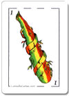     																				 | 2     |   0.93 | 0.025|
|   																					   | 3      |    0.86 | 0.025 |
| 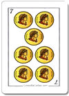   																					  | 4      |    0.78 | 0.025 |
|  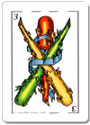  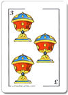       | 5      |    0.71 | 0.1 |
|  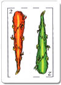         | 6      |    0.64 | 0.1 |
| 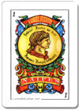      														  | 7      |    0.57 | 0.05 |
| 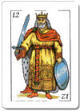  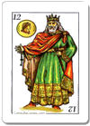 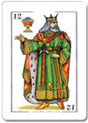       | 8      |    0.5 | 0.1 |
| 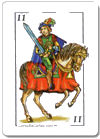   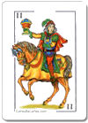       | 9      |    0.43 | 0.1 |
|  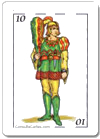 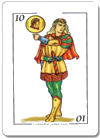        | 10      |    0.36 | 0.1 |
|  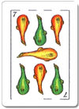  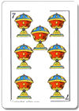       															| 11      |    0.21 | 0.05 |
| 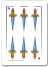  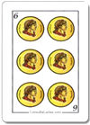 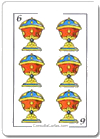       | 12      |    0.14 | 0.05 |
| 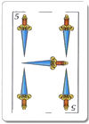          | 13      |    0.07 | 0.05 |
| 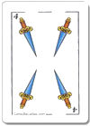 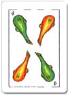         | 14      |    0 | 0.05 |

### Modelado de acciones, jugadas y tácticas:

| Acción         | Denominación       |
| ------------- |:-------------:|
| Tirar carta         | check       |
| Irse al mazo         | fold       |
| Envido         | bet       |
| Envido Envido         | bet       |
| Real envido         | raise       |
| Envido Real envido         | raise       |
| Falta envido         | raise && allIn       |
| Truco        | bet       |
| Re Truco        | raise       |
| Vale cuatro        | raise       |
| Quiero        | call      |
| No Quiero        | fold       |

### Modelado de perfiles de jugadores

#### Según su perfil de estrategia

**Formula del indice de mentira:**

`IM = (( (bets when mano = 'malas' || 'muy malas')  + (raise when mano = 'malas' || 'muy malas') ) / (bets + raises) ) * 100`

`IM = (0,1)`

| Expresión matematica       | Termino linguistico       | 
| ------------- |:-------------:|
| A = 1     				 | Absoluto      |
| A = (0.80, 1)     				 | Muy alto     |
| A = (0.60, 0.80)     				 | Alto     |
| A = (0.40, 0.60)     				 | Medio     |
| A = (0.20, 0.40)     				 | Bajo     |
| A = (0, 0.20)     				 | Muy Bajo     |
| A = (0,1)     				 | Impredecible    |

**Formula indice de agresión:**

`(bets + raises) / (bets + raises + calls + checks) * 100`

| Expresión matematica       | Termino linguistico       | 
| ------------- |:-------------:|
| A = 1     				 | Absoluto      |
| A = (0.80, 1)     				 | Muy alto     |
| A = (0.60, 0.80)     				 | Alto     |
| A = (0.40, 0.60)     				 | Medio     |
| A = (0.20, 0.40)     				 | Bajo     |
| A = (0, 0.20)     				 | Muy Bajo     |
| A = (0,1)     				 | Impredecible    |

**Indice de variabilidad:**

``

**¿Cómo medirian la variabilidad de juego? :)**

| Expresión matematica       | Termino linguistico       | 
| ------------- |:-------------:|
| A = 1     				 | Absoluto      |
| A = (0.80, 1)     				 | Muy alto     |
| A = (0.60, 0.80)     				 | Alto     |
| A = (0.40, 0.60)     				 | Medio     |
| A = (0.20, 0.40)     				 | Bajo     |
| A = (0, 0.20)     				 | Muy Bajo     |
| A = (0,1)     				 | Impredecible    |

Tiene en cuenta: (A) Indice de mentira (Oportunidades que mintió sobre oportunidades que no lo hizo) , (B) Indice de agresión (Oportunidades que aumentó apuesta sobre oportunidades que no lo hizo) y (C) Indice de variabilidad (Frecuencia en la cambia el patrón de estrategia en función del resto)

| Nombre  | Descripción | Indice de mentira | Expresión Linguistica | Indice de agresión | Expresión Linguistica | Indice de variabilidad | Expresión Linguistica |  Tendencia a cantar con manos |
| ------------- |:-------------:|:-----:|:-----:|:-----:|:-----:|:-----:|:-----:|:-----:|
| Creativo  | Cambia sus tácticas con frecuencia, crea nuevas jugadas espontaneamente. | (0,1) | Impredecible | (0,1) | Impredecible | (0.80, 1)  | Muy Alta | Impredecible |
| Temerario | Miente con mucha frecuencia, y suele arriesgar muchos puntos teniendo cartas pobres.  | (0.80, 1) | Muy alto | (0.80, 1) | Muy alto | (0.20, 0.40) | Bajo | Malas |
| Tradicional | Miente seguido con cartas medias y malas, en alguna ocasión hace un gran aumento de apuestas con cartas malas.  | (0.60, 0.80) | Alto | (0.60, 0.80) | Alto |  | Bajo | Medias o Malas |
| Pescador | Canta cuando tiene cartas buenas y medias, aunque cada tanto realiza una mentira teniendo cartas malas. | (0.40, 0.60) | Medio | (0.40, 0.60) | Medio | (0.20, 0.40) | Bajo | Buenas o Medias|
| Conservador | Canta cuando tiene buenas cartas. Suele decir que no quiere cuando tiene cartas malas. | (0.20, 0.40) | Bajo| (0.20, 0.40) | Bajo | (0.20, 0.40) | Bajo | Muy Buenas o Buenas |
| Miedoso | Solo canta cuando tiene cartas excelentes. Prácticamente renuncia a todos los aumentos de apuesta. | 0 | Nulo| (0, 0.20) | Muy Bajo | (0.20, 0.40) | Bajo | Muy Buenas |

## Próximos pasos en el analísis

* Construir un indice para medir variabilidad de juego.
* Clasificar valor de las manos.
* Modelar estados del juego
* Clasificar jugadas (plays)
* Calcular valor esperado de jugadas y acciones segun diferentes estados.

## ¿Y vos, cómo encararias el desarrollo de un agente de aprendizaje reforzado para el truco Argentino?

¡No dudes en participar de este proyecto con tus ideas!

## Referencias y Bibliografía adicional

* David Sklansky (1987). The Theory of Poker. Two Plus Two Publications. ISBN 1-880685-00-0.
* Zadeh, L. A. (1965). Fuzzy sets. Information and control, 8(3), 338-353

### Más literatura cientifica:

* Billings, D., Schaeffer, J., & Szafron, D. (1999). Using probabilistic knowledge and simulation to play poker. In In AAAI National Conference. http://www.aaai.org/Papers/AAAI/1999/AAAI99-099.pdf
* Barone, L., & While, L. (2000, July). Adaptive learning for poker. In Proceedings of the 2nd Annual Conference on Genetic and Evolutionary Computation (pp. 566-573). Morgan Kaufmann Publishers Inc.. http://www.cs.bham.ac.uk/~wbl/biblio/gecco2000/RW179.pdf
* Johansson, U., Sonstrod, C., & Niklasson, L. (2006, December). Explaining Winning Poker--A Data Mining Approach. In Machine Learning and Applications, 2006. ICMLA'06. 5th International Conference on (pp. 129-134). IEEE. https://ieeexplore.ieee.org/abstract/document/4041481/